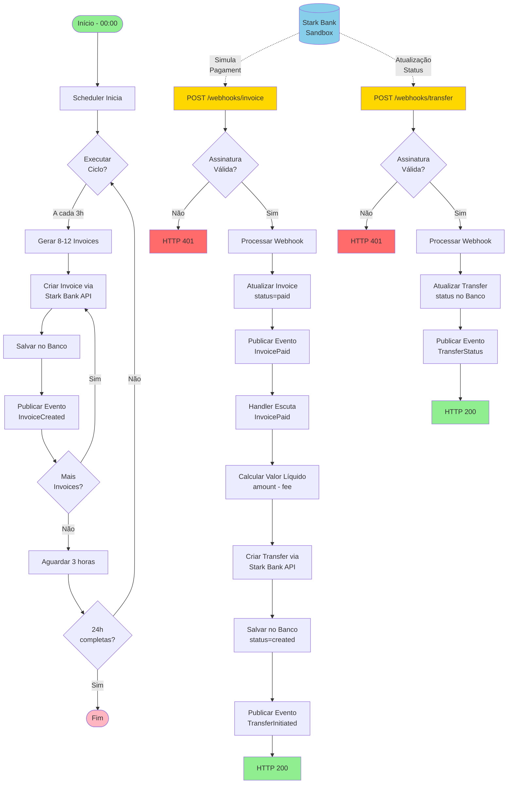
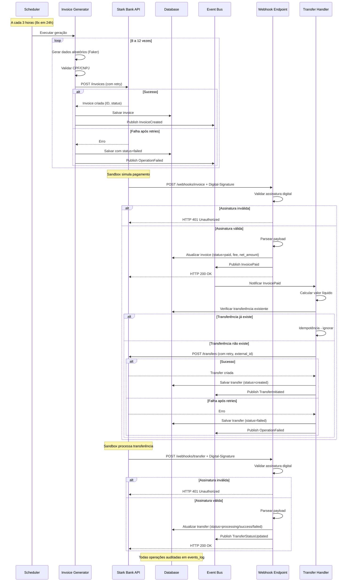
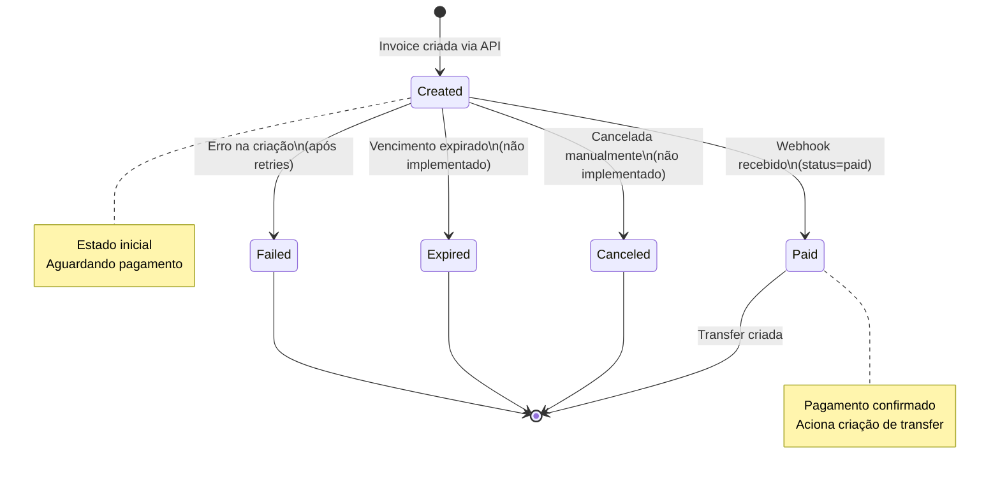
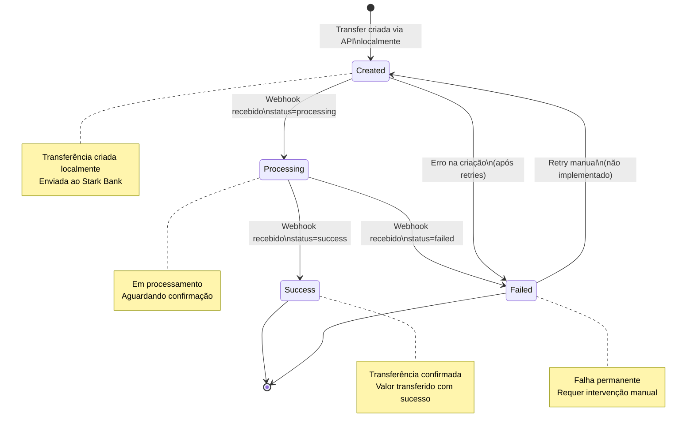
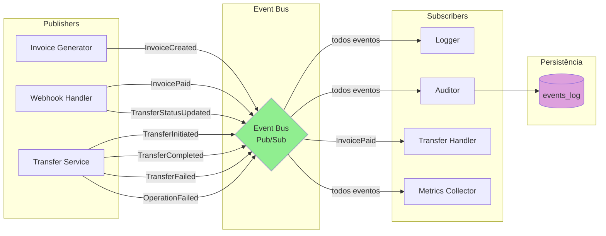
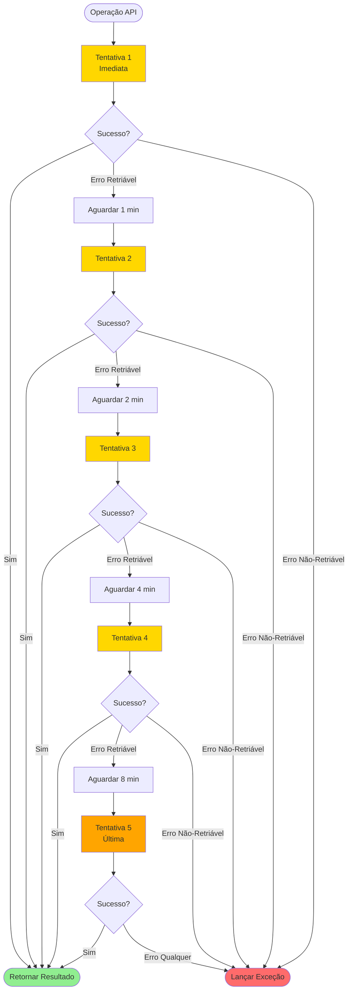
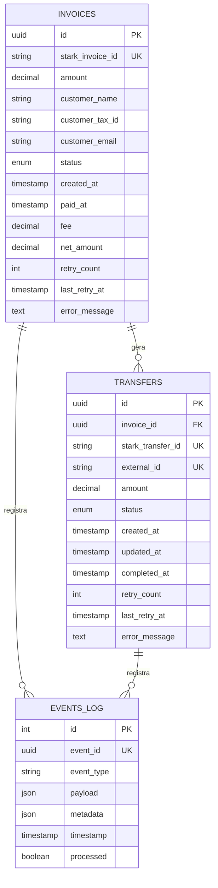

# Stark Bank Challenge - Requisitos de Negócio

**Versão:** 1.0  
**Data:** Fevereiro 2026  
**Autor:** Candidato Processo Seletivo Stark Bank

## 1. Contexto

Este documento descreve os requisitos de negócio para o desafio técnico do processo seletivo Stark Bank. O objetivo é desenvolver uma aplicação que automatize a emissão de faturas (invoices), processe pagamentos via webhooks e realize transferências automáticas dos valores recebidos.

### 1.1. Ambiente

- Plataforma: Stark Bank Sandbox
- Python 3.14
- FastAPI

## 2. Objetivos

### 2.1. Objetivo Principal
Desenvolver uma integração automatizada com os serviços do Stark Bank que demonstre:

- Capacidade de integração com APIs externas
- Arquitetura orientada a eventos
- Tratamento robusto de erros e retry
- Boas práticas de segurança e logging
- Monolito modular
- Não deve utilizar pydantic

### 2.2. Objetivos Específicos

- Automatizar a emissão periódica de invoices
- Processar notificações de pagamento via webhooks
- Executar transferências automáticas de valores recebidos
- Garantir rastreabilidade completa das operações
- Implementar mecanismos de resiliência e tolerância a falhas

## 3. Requisitos Funcionais

### RF001: Geração Automática de Invoices
**Descrição:** O sistema deve emitir invoices automaticamente a cada 3 horas durante 24 horas.

**Critérios de Aceitação:**

- Emitir entre 8 e 12 invoices por ciclo (quantidade aleatória)
- Gerar dados de pagadores aleatórios (nome, CPF/CNPJ, email)
- Validar CPF/CNPJ antes de criar invoice
- Executar 8 ciclos completos (24 horas / 3 horas)
- Persistir todas as invoices criadas no banco de dados
- Publicar evento InvoiceCreated para cada invoice gerada
- Continuar execução mesmo se algumas invoices falharem

**Regras de Negócio:**

- Valor da invoice: entre R$ 100,00 e R$ 1.000,00 (aleatório)
- Vencimento: 3 dias após criação
- CPF deve ter 11 dígitos e ser válido
- CNPJ deve ter 14 dígitos e ser válido

### RF002: Processamento de Webhooks de Pagamento
**Descrição:** O sistema deve receber e processar notificações de pagamento enviadas pelo Stark Bank.

**Critérios de Aceitação:**

- Endpoint público `POST /webhooks/invoice`
- Validar assinatura digital do webhook (segurança)
- Extrair dados do pagamento (invoice_id, amount, fee)
- Atualizar status da invoice no banco de dados
- Calcular valor líquido (amount - fee)
- Publicar evento InvoicePaid após processar
- Retornar HTTP 200 em caso de sucesso
- Retornar HTTP 401 se assinatura inválida
- Retornar HTTP 400 se payload malformado

**Regras de Negócio:**

- Apenas invoices com status "paid" devem acionar transferência
- Valor líquido = valor bruto - taxas do Stark Bank
- Webhook deve ser idempotente (processar duplicatas sem erro)

### RF003: Transferências Automáticas
**Descrição:** O sistema deve transferir automaticamente os valores recebidos (líquidos) para a conta do Stark Bank.

**Critérios de Aceitação:**

- Transferir valor líquido (amount - fee)
- Usar dados da conta destino especificada
- Garantir idempotência via external_id
- Persistir transferência no banco de dados
- Publicar evento TransferCompleted após sucesso
- Não duplicar transferências para mesma invoice

**Dados da Conta Destino:**

- Banco: 20018183
- Agência: 0001
- Conta: 6341320293482496
- Nome: Stark Bank S.A.
- CNPJ: 20.018.183/0001-80
- Tipo: pagamento

**Regras de Negócio:**

- `external_id = invoice-{invoice_id}` (garante idempotência)
- Transferência só deve ser criada após confirmação de pagamento
- Em caso de falha, sistema deve realizar retry automático

### RF004: Processamento de Webhooks de Transferência
**Descrição:** O sistema deve receber e processar notificações de status de transferência enviadas pelo Stark Bank.

**Critérios de Aceitação:**

- Endpoint público `POST /webhooks/transfer`
- Validar assinatura digital do webhook (segurança)
- Extrair dados da transferência (transfer_id, status, amount)
- Atualizar status da transferência no banco de dados
- Publicar evento TransferStatusUpdated após processar
- Retornar HTTP 200 em caso de sucesso
- Retornar HTTP 401 se assinatura inválida
- Retornar HTTP 400 se payload malformado

**Regras de Negócio:**

- Processar atualizações de status: processing, success, failed
- Status "success" indica transferência completada com sucesso
- Status "failed" indica falha definitiva (requer análise manual)
- Webhook deve ser idempotente (processar duplicatas sem erro)
- Registrar todas as atualizações em auditoria

### RF005: Consulta de Invoices
**Descrição:** O sistema deve expor endpoints para consulta de invoices criadas.

**Critérios de Aceitação:**

- `GET /invoices` - lista todas as invoices
- `GET /invoices/{id}` - consulta invoice específica
- Suportar filtros por status (created, paid, failed)
- Suportar paginação (limit, offset)
- Retornar dados completos da invoice
- Requer autenticação via API Key

### RF006: Consulta de Transferências
**Descrição:** O sistema deve expor endpoints para consulta de transferências realizadas.

**Critérios de Aceitação:**

- `GET /transfers` - lista todas as transferências
- `GET /transfers/{id}` - consulta transferência específica
- Suportar filtros por status (processing, success, failed)
- Suportar paginação (limit, offset)
- Retornar dados completos da transferência
- Requer autenticação via API Key

### RF007: Health Check
**Descrição:** O sistema deve expor endpoint para verificação de saúde da aplicação.

**Critérios de Aceitação:**

- `GET /health` - verifica status da aplicação
- Verificar conectividade com banco de dados
- Retornar timestamp da verificação
- Endpoint público (sem autenticação)

## 4. Requisitos Não-Funcionais

### RNF001: Confiabilidade e Resiliência
**Descrição:** O sistema deve ser resiliente a falhas temporárias da API do Stark Bank.

**Critérios de Aceitação:**

- Implementar retry automático em todas as integrações
- Estratégia de retry: 5 tentativas com backoff exponencial

  - Tentativa 1: imediata
  - Tentativa 2: após 1 minuto (60s)
  - Tentativa 3: após 2 minutos (120s)
  - Tentativa 4: após 4 minutos (240s)
  - Tentativa 5: após 8 minutos (480s)

- Fazer retry apenas em erros retriáveis (timeout, 5xx, 429)
- NÃO fazer retry em erros de validação (4xx exceto 429)
- Registrar todas as tentativas em logs
- Persistir contadores de retry no banco de dados

**Erros Retriáveis:**

- Timeout de conexão
- Erros 5xx (server error)
- Erro 429 (rate limit)
- Erros de rede (ConnectionError)

**Erros Não-Retriáveis:**

- Erros 400, 401, 403, 404, 422 (client error)
- Erros de validação de dados
- Erros de autenticação

### RNF002: Rastreabilidade e Auditoria
**Descrição:** O sistema deve manter registro completo de todas as operações.

**Critérios de Aceitação:**

- Logging estruturado (formato JSON) de todas operações
- Persistir todos os eventos na tabela `events_log`
- Logs devem incluir: timestamp, event_type, payload, metadata
- Níveis de log apropriados (INFO, WARNING, ERROR)
- Não expor dados sensíveis em logs (chaves, senhas)
- Correlacionar operações via event_id único
- Armazenar logs em arquivo e console

**Eventos Auditados:**

- invoice.created - Invoice criada
- invoice.paid - Invoice paga (via webhook)
- transfer.initiated - Transferência iniciada
- transfer.processing - Transferência em processamento (via webhook)
- transfer.completed - Transferência concluída (via webhook)
- transfer.failed - Transferência falhou (via webhook)
- operation.failed - Operação falhou após todos os retries
- error.occurred - Erro capturado

### RNF003: Segurança
**Descrição:** O sistema deve implementar controles de segurança adequados.

**Critérios de Aceitação:**

- Validar assinatura digital de todos os webhooks
- Autenticação via API Key para endpoints sensíveis
- Credenciais em variáveis de ambiente (nunca no código)
- Comparação segura de API Keys (proteção contra timing attacks)
- HTTPS obrigatório em produção
- Não expor stack traces em respostas de erro
- Rate limiting em endpoints públicos (futuro)

**Endpoints Públicos:**

- `GET /health` - Sem autenticação
- `POST /webhooks/invoice` - Validado por assinatura digital
- `POST /webhooks/transfer` - Validado por assinatura digital

**Endpoints Protegidos (requerem API Key via header X-API-Key):**

- `GET /invoices`
- `GET /invoices/{id}`
- `GET /transfers`
- `GET /transfers/{id}`
- `GET /docs` (Swagger)
- `GET /openapi.json`

### RNF004: Performance
**Critérios de Aceitação:**

- Criar invoice: < 5 segundos (sem retry)
- Processar webhook: < 2 segundos
- Criar transferência: < 5 segundos (sem retry)
- Consultar invoices/transfers: < 1 segundo
- Scheduler deve executar pontualmente a cada 3 horas

### RNF005: Escalabilidade

- Suportar criação de 96 invoices em 24 horas (8 ciclos × 12 max)
- Processar webhooks concorrentemente (se múltiplos chegarem)
- Banco de dados deve suportar crescimento de dados
- Arquitetura modular permite futura extração de microserviços

### RNF006: Manutenibilidade

- Arquitetura modular (monolito modular)
- Desacoplamento via Event Bus
- Código testável (cobertura > 85%)
- Documentação completa (negócio + arquitetura + API)
- Python 3.13 com bibliotecas atualizadas
- NÃO usar Pydantic (alinhamento com stack Stark Bank)
- Type hints em todo o código
- Linting e formatação automatizados (Ruff)

## 5. Regras de Negócio

### RN001: Geração de Dados Aleatórios

- Usar biblioteca Faker para gerar nomes realistas
- 70% de invoices com CPF (pessoa física)
- 30% de invoices com CNPJ (pessoa jurídica)
- Valores aleatórios entre R$ 100,00 e R$ 1.000,00
- Quantidade aleatória entre 8 e 12 invoices por ciclo

### RN002: Validação de Documentos

- CPF: 11 dígitos numéricos, validar dígitos verificadores
- CNPJ: 14 dígitos numéricos, validar dígitos verificadores
- Rejeitar CPF/CNPJ com todos os dígitos iguais (ex: 111.111.111-11)

### RN003: Cálculo de Valor Líquido

- valor_liquido = valor_bruto - taxas
- Taxas são informadas pelo Stark Bank no webhook
- Valor líquido nunca pode ser negativo

### RN004: Idempotência de Transferências

- Usar `external_id = invoice-{invoice_id}` em todas as transferências
- Se transferência com mesmo external_id já existe, retornar a existente
- Não criar transferências duplicadas para mesma invoice

### RN005: Estados de Invoice

Estados válidos:

- `created` - Invoice criada, aguardando pagamento
- `paid` - Invoice paga, confirmada via webhook
- `canceled` - Invoice cancelada
- `expired` - Invoice expirada 

### RN006: Estados de Transferência

Estados válidos:

- `created` - Transferência criada localmente
- `processing` - Transferência em processamento no Stark Bank
- `success` - Transferência concluída com sucesso
- `failed` - Transferência falhou definitivamente

## 6. Restrições

**Técnicas**

- Linguagem: Python 3.13 obrigatório
- Stack: Alinhada com Stark Bank (sem Pydantic)
- API: Stark Bank SDK v2.14.0+
- Banco de dados: SQLite (persistente)
- Deploy: Railway free tier

**Temporais**

- Execução: 24 horas contínuas
- Intervalo de geração: 3 horas (fixo)

**Funcionais**

- Ambiente: Stark Bank Sandbox apenas
- Conta destino: Fixa, conforme especificado
- Scheduler: Processo separado da API

## 7. Diagramas

### 7.1. Fluxo Geral do Processo

### 7.2. Diagrama de Sequência - Fluxo Completo

### 7.3. Diagrama de Estados - Invoice

### 7.4. Diagrama de Estados - Transfer

### 7.5. Arquitetura de Módulos

### 7.6. Fluxo de Eventos (Event Bus)

### 7.7. Estratégia de Retry

**Erros Retriáveis:**

- Timeout (ConnectionTimeout, ReadTimeout)
- HTTP 5xx (500, 502, 503, 504)
- HTTP 429 (Rate Limit)
- ConnectionError

**Erros Não-Retriáveis:**

- HTTP 4xx (400, 401, 403, 404, 422)
- ValidationError
- AuthenticationError

## 8. Modelo de Dados

### 8.1. Estrutura do Banco de Dados

## 9. Critérios de Aceite do Projeto

### 9.1. Funcionalidade

- Sistema gera 8-12 invoices a cada 3 horas
- Sistema executa por 24 horas (8 ciclos completos)
- Webhook de invoice processa pagamentos corretamente
- Webhook de transfer processa atualizações de status corretamente
- Transferências são criadas automaticamente
- Valor líquido calculado corretamente (amount - fee)
- Dados transferidos para conta Stark Bank especificada
- Status de transferências atualizado via webhook
- Endpoints de consulta funcionam corretamente

### 9.2. Qualidade

- Cobertura de testes > 85%
- Todos comportamentos testados
- Retry funciona conforme especificado
- Idempotência de transferências validada
- Validação de CPF/CNPJ implementada
- API Key protege endpoints corretamente

### 9.3. Documentação

- Documento de arquitetura completo
- Documento de especificação da API
- README com instruções de execução
- Diagramas incluídos na documentação
- Código comentado onde necessário

### 9.4. Entrega

- Código no repositório GitHub público
- Aplicação deployada no Railway
- Executando por 24 horas
- Logs e evidências de execução
- Todas dependências documentadas

## 10. Glossário

- Invoice: Fatura/cobrança gerada para um cliente
- Transfer: Transferência bancária para conta destino
- Webhook: Notificação HTTP enviada por evento externo
- Event Bus: Sistema de mensageria pub/sub para desacoplamento
- Retry: Tentativa automática após falha
- Backoff Exponencial: Estratégia de espera crescente entre retries
- Idempotência: Propriedade de operação produzir mesmo resultado se executada múltiplas vezes
- External ID: Identificador externo para garantir idempotência
- API Key: Chave de autenticação para acesso a API
- CPF: Cadastro de Pessoa Física (11 dígitos)
- CNPJ: Cadastro Nacional de Pessoa Jurídica (14 dígitos)
- Sandbox: Ambiente de testes que simula produção
- DTO: Data Transfer Object - objeto para transferência de dados
- Valor Líquido: Valor bruto menos taxas

## 11. Referências

- Stark Bank API Documentation ()
- Stark Bank Python SDK
- FastAPI Documentation
- Python 3.14 Release Notes
- Railway Documentation
