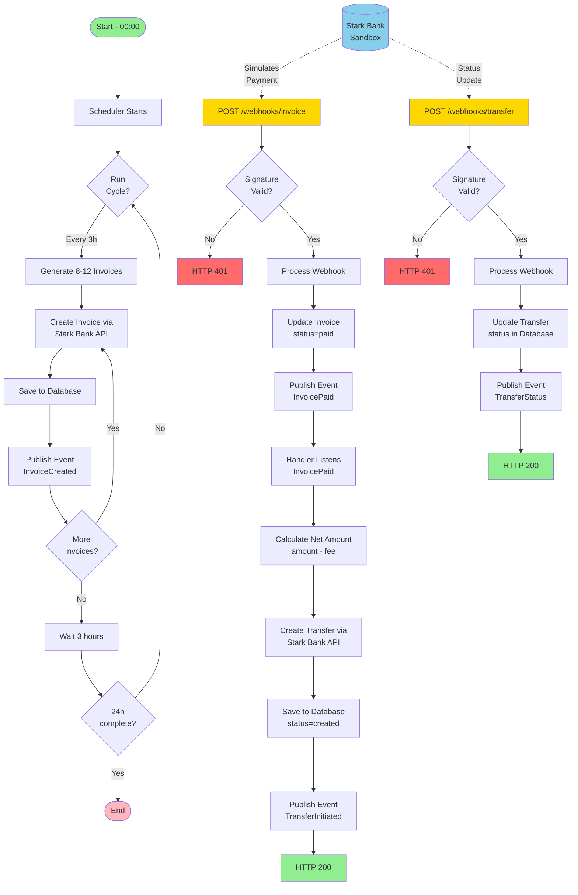
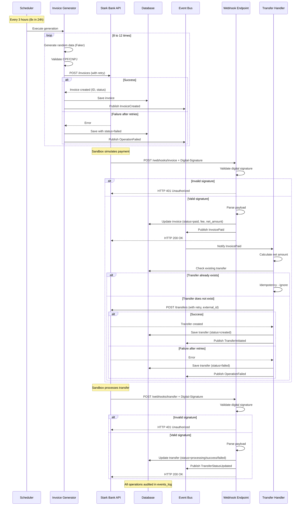
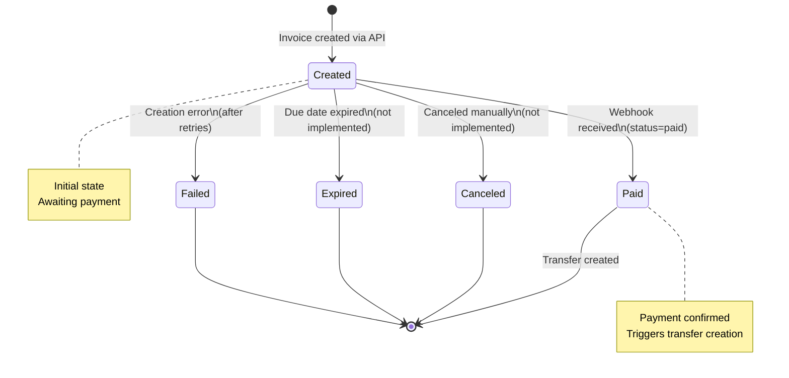
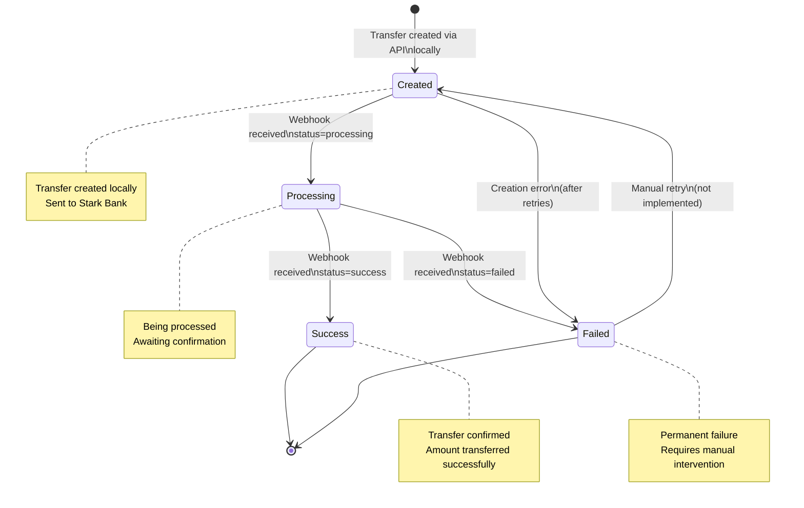
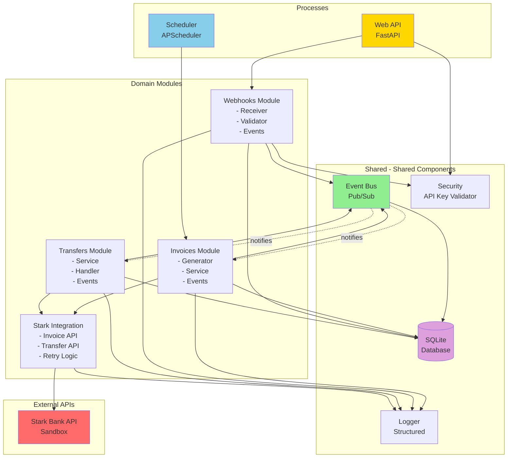
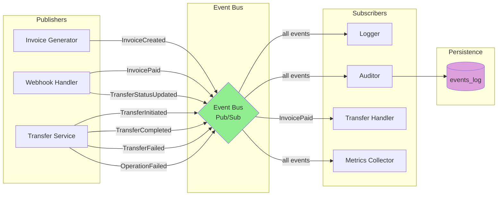
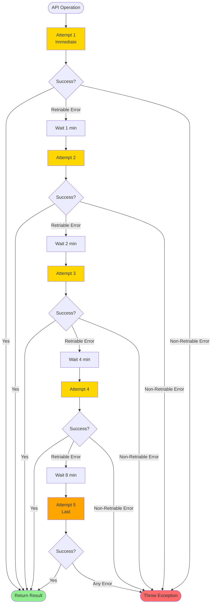
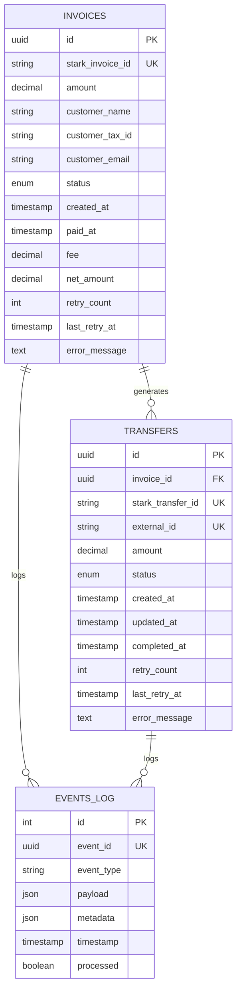

# Stark Bank Challenge - Business Requirements

**Version:** 1.0  
**Date:** February 2026  
**Author:** Stark Bank Selection Process Candidate

## 1. Context

This document describes the business requirements for the Stark Bank technical challenge. The goal is to develop an application that automates invoice issuance, processes payments via webhooks, and performs automatic transfers of received amounts.

### 1.1. Environment

- Platform: Stark Bank Sandbox
- Python 3.14
- FastAPI

## 2. Objectives

### 2.1. Main Objective
Develop an automated integration with Stark Bank services that demonstrates:

- Ability to integrate with external APIs
- Event-driven architecture
- Robust error handling and retry
- Security and logging best practices
- Modular monolith

### 2.2. Specific Objectives

- Automate periodic invoice issuance
- Process payment notifications via webhooks
- Execute automatic transfers of received amounts
- Ensure complete traceability of operations
- Implement resilience and fault tolerance mechanisms

## 3. Functional Requirements

### RF001: Automatic Invoice Generation
**Description:** The system must automatically issue invoices every 3 hours for 24 hours.

**Acceptance Criteria:**

- Issue between 8 and 12 invoices per cycle (random quantity)
- Generate random payer data (name, CPF/CNPJ, email)
- Validate CPF/CNPJ before creating an invoice
- Execute 8 complete cycles (24 hours / 3 hours)
- Persist all created invoices in the database
- Publish an InvoiceCreated event for each generated invoice
- Continue execution even if some invoices fail

**Business Rules:**

- Invoice amount: between R$ 100.00 and R$ 1,000.00 (random)
- Due date: 3 days after creation
- CPF must have 11 digits and be valid
- CNPJ must have 14 digits and be valid

### RF002: Payment Webhook Processing
**Description:** The system must receive and process payment notifications sent by Stark Bank.

**Acceptance Criteria:**

- Public endpoint `POST /webhooks/invoice`
- Validate webhook digital signature (security)
- Extract payment data (invoice_id, amount, fee)
- Update invoice status in the database
- Calculate net amount (amount - fee)
- Publish InvoicePaid event after processing
- Return HTTP 200 on success
- Return HTTP 401 if signature is invalid
- Return HTTP 400 if payload is malformed

**Business Rules:**

- Only invoices with "paid" status should trigger a transfer
- Net amount = gross amount - Stark Bank fees
- Webhook must be idempotent (process duplicates without error)

### RF003: Automatic Transfers
**Description:** The system must automatically transfer received amounts (net) to the Stark Bank account.

**Acceptance Criteria:**

- Transfer net amount (amount - fee)
- Use the specified destination account details
- Ensure idempotency via external_id
- Persist transfer in the database
- Publish TransferCompleted event after success
- Do not duplicate transfers for the same invoice

**Destination Account Details:**

- Bank: 20018183
- Branch: 0001
- Account: 6341320293482496
- Name: Stark Bank S.A.
- CNPJ: 20.018.183/0001-80
- Type: payment

**Business Rules:**

- `external_id = invoice-{invoice_id}` (ensures idempotency)
- Transfer must only be created after payment confirmation
- In case of failure, the system must perform automatic retry

### RF004: Transfer Webhook Processing
**Description:** The system must receive and process transfer status notifications sent by Stark Bank.

**Acceptance Criteria:**

- Public endpoint `POST /webhooks/transfer`
- Validate webhook digital signature (security)
- Extract transfer data (transfer_id, status, amount)
- Update transfer status in the database
- Publish TransferStatusUpdated event after processing
- Return HTTP 200 on success
- Return HTTP 401 if signature is invalid
- Return HTTP 400 if payload is malformed

**Business Rules:**

- Process status updates: processing, success, failed
- Status "success" indicates transfer completed successfully
- Status "failed" indicates definitive failure (requires manual review)
- Webhook must be idempotent (process duplicates without error)
- Record all updates in audit log

### RF005: Invoice Query
**Description:** The system must expose endpoints for querying created invoices.

**Acceptance Criteria:**

- `GET /invoices` - lists all invoices
- `GET /invoices/{id}` - queries a specific invoice
- Support filtering by status (created, paid, failed)
- Support pagination (limit, offset)
- Return complete invoice data
- Requires API Key authentication

### RF006: Transfer Query
**Description:** The system must expose endpoints for querying performed transfers.

**Acceptance Criteria:**

- `GET /transfers` - lists all transfers
- `GET /transfers/{id}` - queries a specific transfer
- Support filtering by status (processing, success, failed)
- Support pagination (limit, offset)
- Return complete transfer data
- Requires API Key authentication

### RF007: Health Check
**Description:** The system must expose an endpoint for checking application health.

**Acceptance Criteria:**

- `GET /health` - checks application status
- Verify database connectivity
- Return check timestamp
- Public endpoint (no authentication)

## 4. Non-Functional Requirements

### NFR001: Reliability and Resilience
**Description:** The system must be resilient to temporary failures of the Stark Bank API.

**Acceptance Criteria:**

- Implement automatic retry in all integrations
- Retry strategy: 5 attempts with exponential backoff

  - Attempt 1: immediate
  - Attempt 2: after 1 minute (60s)
  - Attempt 3: after 2 minutes (120s)
  - Attempt 4: after 4 minutes (240s)
  - Attempt 5: after 8 minutes (480s)

- Retry only on retriable errors (timeout, 5xx, 429)
- Do NOT retry on validation errors (4xx except 429)
- Log all attempts
- Persist retry counters in the database

**Retriable Errors:**

- Connection timeout
- 5xx errors (server error)
- 429 error (rate limit)
- Network errors (ConnectionError)

**Non-Retriable Errors:**

- 400, 401, 403, 404, 422 errors (client error)
- Data validation errors
- Authentication errors

### NFR002: Traceability and Audit
**Description:** The system must maintain a complete record of all operations.

**Acceptance Criteria:**

- Structured logging (JSON format) for all operations
- Persist all events in the `events_log` table
- Logs must include: timestamp, event_type, payload, metadata
- Appropriate log levels (INFO, WARNING, ERROR)
- Do not expose sensitive data in logs (keys, passwords)
- Correlate operations via unique event_id
- Store logs in file and console

**Audited Events:**

- invoice.created - Invoice created
- invoice.paid - Invoice paid (via webhook)
- transfer.initiated - Transfer initiated
- transfer.processing - Transfer in processing (via webhook)
- transfer.completed - Transfer completed (via webhook)
- transfer.failed - Transfer failed (via webhook)
- operation.failed - Operation failed after all retries
- error.occurred - Error captured

### NFR003: Security
**Description:** The system must implement appropriate security controls.

**Acceptance Criteria:**

- Validate digital signature of all webhooks
- API Key authentication for sensitive endpoints
- Credentials in environment variables (never in code)
- Secure API Key comparison (protection against timing attacks)
- HTTPS mandatory in production
- Do not expose stack traces in error responses
- Rate limiting on public endpoints (future)

**Public Endpoints:**

- `GET /health` - No authentication
- `POST /webhooks/invoice` - Validated by digital signature
- `POST /webhooks/transfer` - Validated by digital signature

**Protected Endpoints (require API Key via X-API-Key header):**

- `GET /invoices`
- `GET /invoices/{id}`
- `GET /transfers`
- `GET /transfers/{id}`
- `GET /docs` (Swagger)
- `GET /openapi.json`

### NFR004: Performance
**Acceptance Criteria:**

- Create invoice: < 5 seconds (without retry)
- Process webhook: < 2 seconds
- Create transfer: < 5 seconds (without retry)
- Query invoices/transfers: < 1 second
- Scheduler must execute punctually every 3 hours

### NFR005: Scalability

- Support creation of 96 invoices in 24 hours (8 cycles × 12 max)
- Process webhooks concurrently (if multiple arrive)
- Database must support data growth
- Modular architecture allows future extraction of microservices

### NFR006: Maintainability

- Modular architecture (modular monolith)
- Decoupling via Event Bus
- Testable code (coverage > 85%)
- Complete documentation (business + architecture + API)
- Python 3.14 with updated libraries
- Type hints throughout the code
- Automated linting and formatting (Ruff)

## 5. Business Rules

### BR001: Random Data Generation

- Use Faker library to generate realistic names
- 70% of invoices with CPF (individual)
- 30% of invoices with CNPJ (company)
- Random amounts between R$ 100.00 and R$ 1,000.00
- Random quantity between 8 and 12 invoices per cycle

### BR002: Document Validation

- CPF: 11 numeric digits, validate check digits
- CNPJ: 14 numeric digits, validate check digits
- Reject CPF/CNPJ with all identical digits (e.g. 111.111.111-11)

### BR003: Net Amount Calculation

- net_amount = gross_amount - fees
- Fees are provided by Stark Bank in the webhook
- Net amount can never be negative

### BR004: Transfer Idempotency

- Use `external_id = invoice-{invoice_id}` in all transfers
- If a transfer with the same external_id already exists, return the existing one
- Do not create duplicate transfers for the same invoice

### BR005: Invoice States

Valid states:

- `created` - Invoice created, awaiting payment
- `paid` - Invoice paid, confirmed via webhook
- `canceled` - Invoice canceled
- `expired` - Invoice expired

### BR006: Transfer States

Valid states:

- `created` - Transfer created locally
- `processing` - Transfer being processed at Stark Bank
- `success` - Transfer completed successfully
- `failed` - Transfer failed definitively

## 6. Constraints

**Technical**

- Language: Python 3.14 mandatory
- API: Stark Bank SDK v2.14.0+
- Database: SQLite (persistent)
- Deploy: Railway free tier

**Temporal**

- Execution: 24 continuous hours
- Generation interval: 3 hours (fixed)

**Functional**

- Environment: Stark Bank Sandbox only
- Destination account: Fixed, as specified
- Scheduler: Separate process from the API

## 7. Diagrams

### 7.1. General Process Flow

### 7.2. Sequence Diagram - Complete Flow

### 7.3. State Diagram - Invoice

### 7.4. State Diagram - Transfer

### 7.5. Module Architecture

### 7.6. Event Flow (Event Bus)

### 7.7. Retry Strategy

**Retriable Errors:**

- Timeout (ConnectionTimeout, ReadTimeout)
- HTTP 5xx (500, 502, 503, 504)
- HTTP 429 (Rate Limit)
- ConnectionError

**Non-Retriable Errors:**

- HTTP 4xx (400, 401, 403, 404, 422)
- ValidationError
- AuthenticationError

## 8. Data Model

### 8.1. Database Structure

## 9. Project Acceptance Criteria

### 9.1. Functionality

- System generates 8-12 invoices every 3 hours
- System runs for 24 hours (8 complete cycles)
- Invoice webhook processes payments correctly
- Transfer webhook processes status updates correctly
- Transfers are created automatically
- Net amount calculated correctly (amount - fee)
- Funds transferred to specified Stark Bank account
- Transfer statuses updated via webhook
- Query endpoints work correctly

### 9.2. Quality

- Test coverage > 85%
- All behaviors tested
- Retry works as specified
- Transfer idempotency validated
- CPF/CNPJ validation implemented
- API Key protects endpoints correctly

### 9.3. Documentation

- Complete architecture document
- API specification document
- README with execution instructions
- Diagrams included in documentation
- Code commented where necessary

### 9.4. Delivery

- Code in public GitHub repository
- Application deployed on Railway
- Running for 24 hours
- Logs and execution evidence
- All dependencies documented

## 10. Glossary

- Invoice: Bill/charge generated for a customer
- Transfer: Bank transfer to the destination account
- Webhook: HTTP notification sent by an external event
- Event Bus: Pub/sub messaging system for decoupling
- Retry: Automatic reattempt after failure
- Exponential Backoff: Strategy of increasing wait times between retries
- Idempotency: Property of an operation producing the same result if executed multiple times
- External ID: External identifier to ensure idempotency
- API Key: Authentication key for API access
- CPF: Individual Taxpayer Registry (11 digits)
- CNPJ: National Corporate Taxpayer Registry (14 digits)
- Sandbox: Testing environment that simulates production
- DTO: Data Transfer Object - object used for transferring data
- Net Amount: Gross amount minus fees

## 11. References

- Stark Bank API Documentation ()
- Stark Bank Python SDK
- FastAPI Documentation
- Python 3.14 Release Notes
- Railway Documentation
